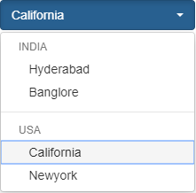

# Grouped Optionset Control : 
This control prolong the existing optionset contol in Dynamics 365 by adding the grouping feature.

Note : Currently, this control only works for single select optionset control, will implement the same for multi-select in a while.

# Control Preview :


# Steps for build/run the control in Visual Studio Code :
1. Clone the repo/ download the zip file.
2. Navigate to ./GroupedOptionsetControl/GroupedOptionsetControl folder.
3. Copy the folder path and open it in visual studio code.
4. Open terminal in vsc(ctrl+`), and run the command `npm install` to install the project dependencies.
5. Now run the command `npm run start`.

# Steps required to build the solution out of a control :
Prerequisites
- Microsoft Powerapps CLI, we can find the installation details [here](https://docs.microsoft.com/en-us/powerapps/developer/component-framework/create-custom-controls-using-pcf#prerequisites-to-use-powerapps-cli).

1. Create a new solution folder and open the Developer command prompt.
2. Change the directory to the newly created folder in previous step.
3. Run the command `pac solution init --publisherName someName --customizationPrefix someSolutionPrefix`.
4. Run the command `pac solution add-reference --path provide path of control project folder where the pcf.proj is available`.
5. Run the command `msbuild /t:restore`.
6. Run the command `msbuild`.
7. Will have the solution file in SolutionFolder/bin/debug folder.

# Registering/configuring the control in Dynamics 365 :
- Deploy the solution which we get in previous steps into Dynamics 365 instance.
- Open an entity form, select the optionset field on the form and click on properties.
- Switch to controls tab, click on `Add Control` link and select the `Grouped Optionset Control`.
- Enable the control on web, mobile and tablet.
- The contol requires "Grouping Options" input property for grouping where we can pass our json.
- Click on the edit icon of the input property and choose the 'Bind to the static value' option.
- Provide your options json in textbox, the json would be like 
```
{"Automation":[606090000,606090001]," Food Service":[606090002,606090003,606090004,606090005],"Heavy Machinery":[606090006],"Industrial Storage":[606090007,606090008,606090009], "Material Handling":[606090010,606090011,606090012]}
```
- Currently, the grouping options input property doesn't accept more than 100 characters even it is textarea/multiple field. I have already raised the issue in forum, meanwhile I have posted the workaround [here]().
- After applying the workaround, save the changes and publish the customizations.
